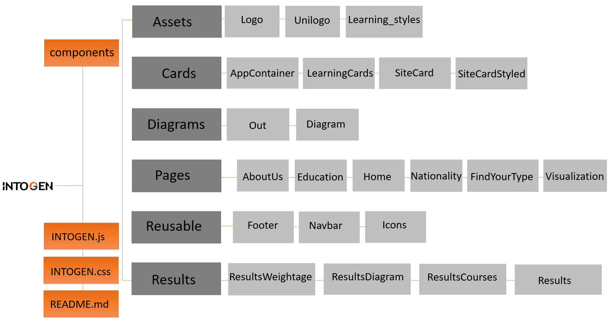
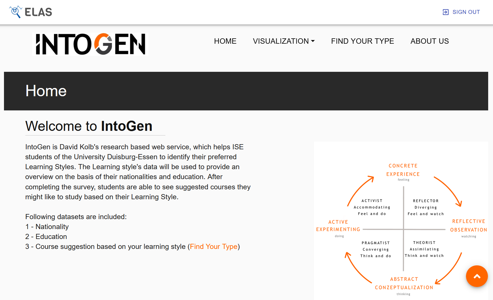
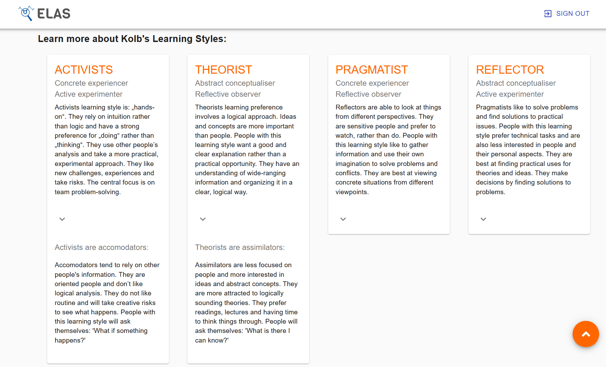
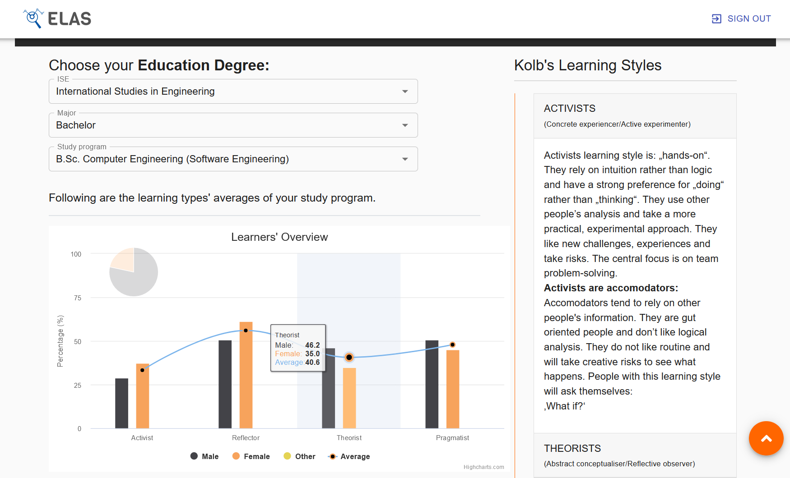
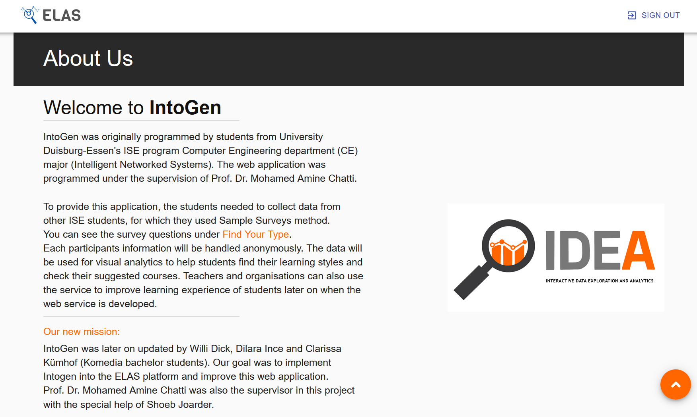
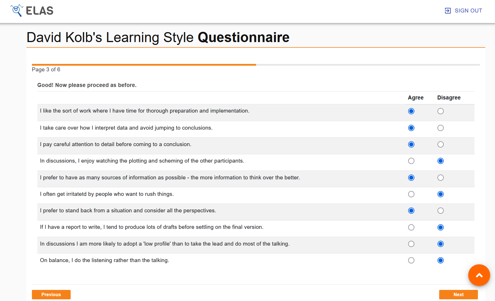
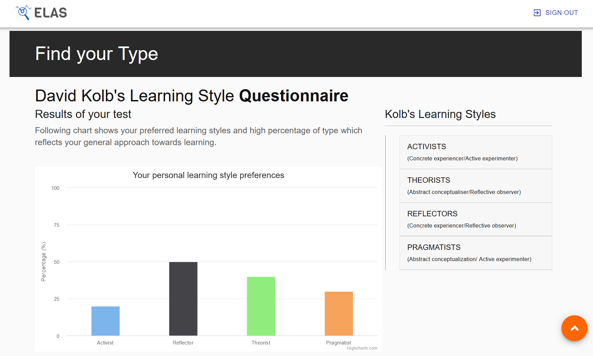
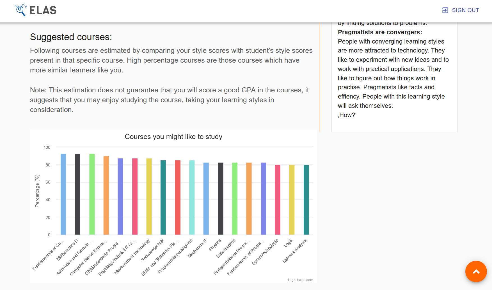

# Intogen
Libraries used:
1. Node.js
2. Material UI
3. Javascript
4. SurveyJS Library
5. React
6. Highcharts
7. Easy Autocomplete 

Project Description:
Intogen is a webservice for students of Universität Duisburg-Essen to find out their personal learning type based on David Kolb's research and find suitable courses for their specific learning type.

Project Architecture:
Image name "ProjectArchitecture.PNG"

Visualization Images:
Image name "image1.jpeg"
Image name "learning_styles.png"
Image name "logo.jpg"
Image name "unilogo.png"

Screenshot of the Project:
Image name "ProjectImage"
Image name "ProjectImage2"
Image name "ProjectImage3"
Image name "ProjectImage4"
Image name "ProjectImage5"
Image name "ProjectImage6"

Project Live Demo Link:


How to run as localhost:
Use "npm install" to install dependencies
Run "npm start" to start frontend localhost
Run "python -m flask run" to start backend localhost

Developers:

Dilara Ince
Clarissa Kümhoff
Willi Dick
<!-- 
<p align="center">

</p>

# IntoGen
### Never study false again – Your Guide to Your Learning Type

## Table of Contents

* [Project Information](#project-information)
* [Project Architecture](#project-architecture)
* [Libraries used](#libraries-used)
* [Visualization](#visualization)
* [Links](#links)
* [Get Started](#get-started)
* [Developers](#developers)

## Project Information

IntoGen is a web service for ISE students of the University Duisburg-Essen to find out their personal learning type based on David Kolb's research.

It is designed to help students
- find their individual learning types with a 40-item questionnaire
- find courses that are suitable for their learning type
- get an overview of the learning types present in other courses, study programs and countries


## Project Architecture


## Libraries used
- Material UI (e.g. Autocomplete, Accordion)
- SurveyJS
- Highcharts

## Visualization








## Links
<a href="">Advertisement Video</a></br>
<a href="">Demo</a>

## Get Started

Make sure you have followed the instructions from the ELAS README.md.

#### Frontend Installation
- Make sure you have downloaded and installed node packages

- Open command prompt/ terminal, move inside 'frontend' folder, and follow the steps below:

```sh
npm install
``` 

- Run the script and start the application

```sh
npm start
``` 

#### Backend Installation
- Open a comand prompt/ terminal, move inside 'backend' folder, and follow the steps below:

```sh
python -m flask run
``` 

Application will start automatically in http://localhost:3000

## Developers
Komedia students in the 4th and 6th semester: </br>
- Dilara Ince </br>
- Clarissa Kümhof </br>
- Willi Dick -->