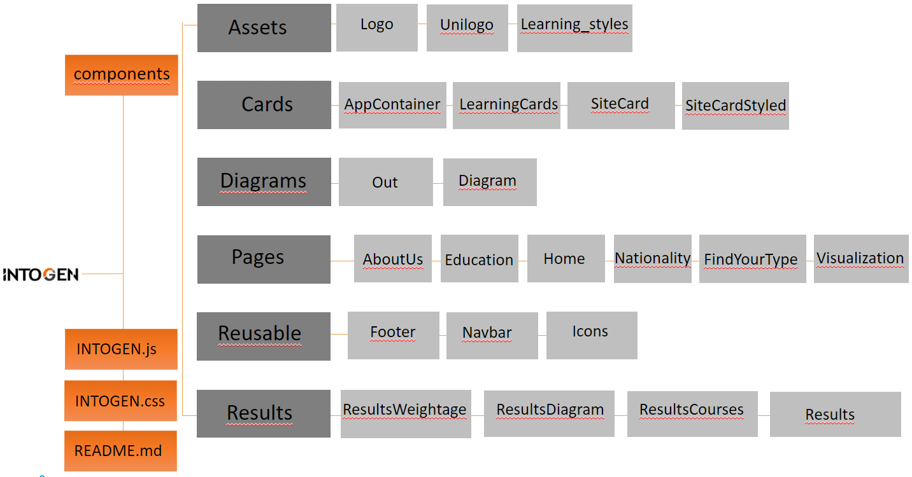

<p align="center">

</p>

# IntoGen
### Never study false again – Your Guide to Your Learning Type

IntoGen is a web service for ISE students of the University Duisburg-Essen to find out their personal learning type based on David Kolb's research.

It is designed to help students
- find their individual learning types with a 40-item questionnaire
- find courses that are suitable for their learning type
- get an overview of the learning types present in other courses, study programs and countries


## Project Architecture


## Libraries used
- Material UI (e.g. Autocomplete, Accordion)
- SurveyJS
- Highcharts


## Visualization


## Links
<a href="">Advertisement Video</a></br>
<a href="">Live Demo</a>

## Get Started

Make sure you have followed the instructions from the ELAS README.md.

#### Frontend Installation
- Make sure you have downloaded and installed node packages

- Open command prompt/ terminal, move inside 'frontend' folder, and follow the steps below:

```sh
npm install
``` 

- Run the script and start the application

```sh
npm start
``` 

#### Backend Installation
- Open a comand prompt/ terminal, move inside 'backend' folder, and follow the steps below:

```sh
python -m flask run
``` 

Application will start automatically in http://localhost:3000

## Developers
Dilara Ince </br>
Clarissa Kümhof </br>
Willi Dick